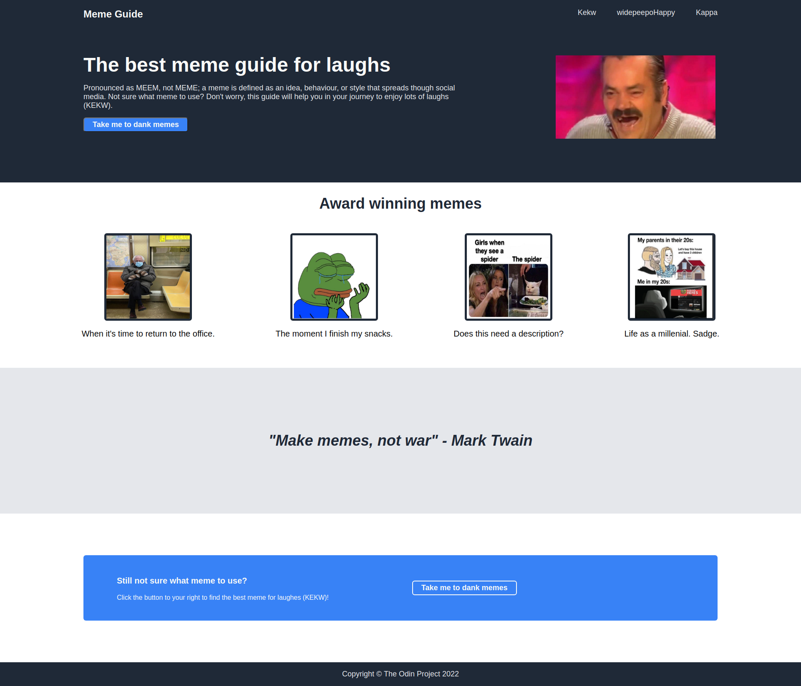

# Project: CSS Website
I developed a website full of memes by using HTML and CSS with links to external webpages.

**Link to project:** https://github.com/chantelspicer/meme_guide

## How It's Made:

**Tech used:** HTML, CSS, VSCode, Git, and GitHub

The Meme Guide project was enjoyable to develop because I laughed along the way while choosing my favourite memes to share with others. I began by creating an index.html file, along with a style.css file and an images folder to ensure seperation and organization of my content. I incorporated HTML content first before moving onto CSS as this allowed me to understand how to change the CSS to better reflect the webpage I wanted to create. Utilizing Chrome DevTools was an important factor when creating the Meme Guide as I was able to inspect and edit the content directly in Chrome, rather than opening each new change from VSCode to the default web browser, thus saving time.

## Optimizations:

Understanding Flexbox was the most important optimization to achieve my desired result. With enough practice, including a game called Flexbox Froggy, I enhanced my knowledge to better understand Flexbox default values, columns, rows, wrapping, and how to align content and items. Moreover, I learned how to separate content to the far left and right, as is the case with my header, where I placed the whole header inside a div, along with separating the right and left content inside their own div. From there, I used display: flex for each div and gaps where I could then alter the spacing and apperance of the left and right content, while remaining on the same line.

## Lessons Learned:

This was my most challenging project thus far. I soon realized that I would have to go back and forth between the HTML and CSS files to achieve my desired result. For example, I would refer back to my HTML content to create classes and placing content inside divs that were not originally included in order to edit the CSS. I used Google as a resource when I was unsure of the most appropriate stylization to use and included comments that I can refer back to. In the end, I reflected upon my progress from my first project, Italian Inspired Recipes, and I am astonished at how much I learned and the excellent result that I acheived in a short time period.

## Examples:
Take a look at my GitHub portfolio:

**GitHub Portfolio:** https://github.com/chantelspicer
